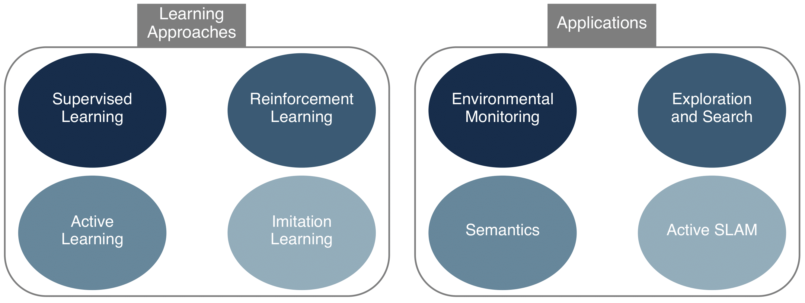
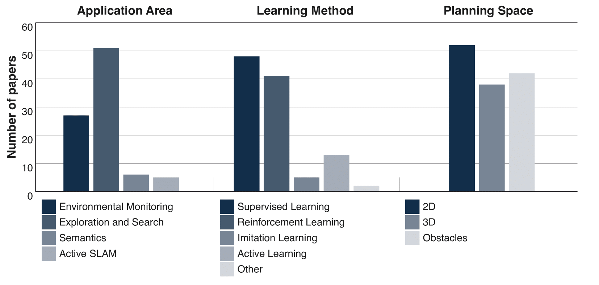

This is the website for the survey paper "Robotic Learning for Informative Path Planning," authored by 
Marija Popović, Joshua Ott, Julius Rückin, and Mykel Kochenderfer. 
The paper is currently under review at the Robotics and Autonomous Systems journal. 
The arXiv pre-print can be found [here](https://arxiv.org/pdf/2404.06940.pdf){:target="_blank" rel="noopener"}.
This website provides a comprehensive catalog of papers reviewed in our survey with publicly available
repositories to facilitate future studies in the field.

## Abstract

Adaptive informative path planning (AIPP) is important to many robotics applications, enabling mobile robots to 
efficiently collect useful data about initially unknown environments. In addition, learning-based methods are 
increasingly used in robotics to enhance adaptability, versatility, and robustness across diverse and complex 
tasks. Our survey explores research on applying robotic learning to AIPP, bridging the gap between these two 
research fields. We begin by providing a mathematical problem definition for general AIPP problems. Next, we 
establish two complementary taxonomies of current work from the perspectives of (i) learning algorithms and 
(ii) robotic applications. We explore synergies, recent trends, and highlight the benefits of learning-based 
methods in AIPP frameworks. Finally, we discuss key challenges and promising future directions to enable more 
generally applicable and robust robotic data-gathering systems through learning. We provide a comprehensive 
catalog of papers reviewed in our survey, including publicly available repositories, to facilitate future 
studies in the field.

If you found this work useful for your own research, feel free to cite it.
```commandline
@article{popovic2024robotic,
  title={{Robotic Learning for Adaptive Informative Path Planning}},
  author={Popović, Marija and Ott, Joshua and R{\"u}ckin, Julius and Kochendorfer, Mykel J},
  journal={arXiv preprint arXiv:2404.06940},
  year={2024}
}
```

# Survey Overview



Our review includes different aspects of learning (Sec. 4): supervised learning, reinforcement learning, imitation 
learning, and active learning. We focus on how these techniques can be used for AIPP in robotics. Furthermore, we 
discuss relevant application domains (Sec. 5), such as environmental monitoring, exploration and search, semantic 
scene understanding, and active simultaneous localization and mapping (SLAM).

# Taxonomy of AIPP Applications



Our taxonomy considers four broad application areas: (i) environmental monitoring; (ii) exploration and search; 
(iii) semantic scene understanding; and (iv) active SLAM. We also include the utilized learning method: supervised 
learning; reinforcement learning; imitation learning; and/or active learning. We provide visual summary statistics 
for our survey according to the application area, learning  method, and planning space considered by each paper.

## Open-Source Code

| **Title**                                                                                                               | **Authors**          | **Venue, Year**                                       | **Code, Latest Commit**                                                                                                          |
|-------------------------------------------------------------------------------------------------------------------------|----------------------|-------------------------------------------------------|----------------------------------------------------------------------------------------------------------------------------------|
| CAtNIPP: Context-Aware Attention-based Network for Informative Path Planning                                            | Cao et al.           | CoRL, 2022                                            | [GitHub](https://github.com/marmotlab/CAtNIPP){:target="_blank" rel="noopener"}, Nov 09, 2022                                    |
| Adaptive Informative Path Planning Using Deep Reinforcement Learning for UAV-based Active Sensing                       | Rückin et al.        | ICRA, 2022                                            | [GitHub](https://github.com/dmar-bonn/ipp-rl){:target="_blank" rel="noopener"}, Jul 14, 2022                                     |
| Learning to Map for Active Semantic Goal Navigation                                                                     | Georgakis et al.     | ICLR, 2022                                            | [GitHub](https://github.com/ggeorgak11/L2M){:target="_blank" rel="noopener"}, Mar 22, 2022                                       |
| Embodied Active Domain Adaptation for Semantic Segmentation via Informative Path Planning                               | Zurbrügg et al.      | RA-L, 2022                                            | [GitHub](https://github.com/ethz-asl/active_learning_for_segmentation){:target="_blank" rel="noopener"}, Dec 06, 2022            |
| SC-Explorer: Incremental 3D Scene Completion for Safe and Efficient Exploration Mapping and Planning                    | Schmid et al.        | arXiv, 2022                                           | [GitHub](https://github.com/ethz-asl/ssc_exploration){:target="_blank" rel="noopener"}, Apr 30, 2024                             |
| An Informative Path Planning Framework for Active Learning in UAV-based semantic mapping                                | Rückin et al.        | T-RO, 2023                                            | [GitHub](https://github.com/dmar-bonn/ipp-al-framework){:target="_blank" rel="noopener"}, Jan 24, 2024                           |
| Fast- and Compute-efficient Sampling-based Local Exploration Planning via Distribution Learning                         | Schmid et al.        | RA-L, 2022                                            | [GitHub](https://github.com/ethz-asl/cvae_exploration_planning){:target="_blank" rel="noopener"}, Nov 09, 2022                   |
| Learning to Learn How to Learn: Self-Adaptive Visual Navigation using Meta-Learning                                     | Wortsman et al.      | CVPR, 2019                                            | [GitHub](https://github.com/allenai/savn){:target="_blank" rel="noopener"}, Sep 22, 2019                                         |
| Autonomous Exploration Under Uncertainty via Deep Reinforcement Learning on Graphs                                      | Chen et al.          | IROS, 2020                                            | [GitHub](https://github.com/RobustFieldAutonomyLab/DRL_graph_exploration){:target="_blank" rel="noopener"}, Jul 10, 2021         |
| Deep Reinforcement Learning for Next-Best-View Planning in Agricultural Applications                                    | Zeng et al.          | ICRA, 2022                                            | [GitHub](https://github.com/zengxyu/vpp-learning){:target="_blank" rel="noopener"}, Apr 05, 2022                                 |
| Sequential Bayesian Optimization for Adaptive Informative Path Planning with Multimodal Sensing                         | Ott et al.           | ICRA, 2023                                            | [GitHub](https://github.com/sisl/SBO_AIPPMS){:target="_blank" rel="noopener"}, Jan 17, 2023                                      |
| Embedded Stochastic Field Exploration with Micro Diving Agents using Bayesian Optimization guided tree-search and GMRFs | Duecker et al.       | IROS, 2021                                            | [GitHub](https://github.com/danielduecker/CBTS-GMRF){:target="_blank" rel="noopener"}, Jul 26, 2021                              |
| An informative path planning framework for UAV-based terrain monitoring                                                 | Popović et al.       | Autonomous Robots, 2020                               | [GitHub](https://github.com/ethz-asl/tmplanner){:target="_blank" rel="noopener"}, Jul 01, 2020                                   |
| Deep Reinforcement Learning for Swarm Systems                                                                           | Hüttenrauch et al.   | JMLR, 2019                                            | [GitHub](https://github.com/ALRhub/deep_rl_for_swarms){:target="_blank" rel="noopener"}, May 15, 2020                            |
| Graph Neural Networks for Decentralized Multi-Robot Path Planning                                                       | Li et al.            | IROS, 2020                                            | [GitHub](https://github.com/proroklab/gnn_pathplanning){:target="_blank" rel="noopener"}, Jun 29, 2021                           |
| Learning Continuous Control Policies for Information-Theoretic Active Perception                                        | Yang et al.          | ICRA, 2023                                            | [GitHub](https://github.com/JaySparrow/RL-for-active-mapping){:target="_blank" rel="noopener"}, May 02, 2023                     |
| Learned Map Prediction for Enhanced Mobile Robot Exploration                                                            | Shrestha et al.      | ICRA, 2019                                            | [GitHub](https://github.com/rakeshshrestha31/map_prediction_enhanced_exploration){:target="_blank" rel="noopener"}, Aug 10, 2020 |
| Online Exploration of Tunnel Networks Leveraging Topological CNN-based World Predictions                                | Saroya et al.        | IROS, 2020                                            | [GitHub](https://github.com/manishsaroya/map_inpainting){:target="_blank" rel="noopener"}, Jul 28, 2020                          |
| Self-Learning Exploration and Mapping for Mobile Robots via Deep Reinforcement Learning                                 | Chen et al.          | AIAA, 2019                                            | [GitHub](https://github.com/RobustFieldAutonomyLab/DRL_robot_exploration){:target="_blank" rel="noopener"}, Sep 15, 2020         |
| Multi-UAV Adaptive Path Planning Using Deep Reinforcement Learning                                                      | Westheider et al.    | IROS, 2023                                            | [GitHub](https://github.com/dmar-bonn/ipp-marl){:target="_blank" rel="noopener"}, Apr 17, 2023                                   |
| Multi-UAV Path Planning for Wireless Data Harvesting With Deep Reinforcement Learning                                   | Bayerlein et al.     | IEEE Open Journal of the Communications Society, 2021 | [GitHub](https://github.com/hbayerlein/uav_data_harvesting){:target="_blank" rel="noopener"}, Jan 13, 2022                       |
| Bag of Views: An Appearance-based Approach to Next-Best-View Planning for 3D Reconstruction                             | Gazani et al.        | RA-L, 2023                                            | [GitHub](https://github.com/ACIS2021/ViewPlanningToolbox){:target="_blank" rel="noopener"}, Aug 09, 2023                         |
| Next-best-view regression using a 3D convolutional neural network                                                       | Vasquez-Gomez et al. | Machine Vision and Applications, 2021                 | [GitHub](https://github.com/irvingvasquez/nbv-regression-dataset){:target="_blank" rel="noopener"}, Feb 07, 2019                 |
| Uncertainty-driven Planner for Exploration and Navigation                                                               | Georgakis et al.     | ICRA, 2022                                            | [GitHub](https://github.com/ggeorgak11/UPEN){:target="_blank" rel="noopener"}, Aug 02, 2022                                      |
| Pred-NBV: Prediction-guided Next-Best-View for 3D Object Reconstruction                                                 | Dhami et al.         | IROS, 2023                                            | [GitHub](https://github.com/raaslab/Pred-NBV){:target="_blank" rel="noopener"}, Mar 02, 2023                                     |
| Occupancy Anticipation for Efficient Exploration and Navigation                                                         | Ramakrishnan et al.  | ECCV, 2020                                            | [GitHub](https://github.com/facebookresearch/OccupancyAnticipation){:target="_blank" rel="noopener"}, Jul 01, 2021               |
| SEER: Safe Efficient Exploration for Aerial Robots using Learning to Predict Information Gain                           | Tao et al.           | ICRA, 2023                                            | [GitHub](https://github.com/tyuezhan/SEER){:target="_blank" rel="noopener"}, Feb 20, 2024                                        |
| Informative Path Planning for Active Learning in Aerial Semantic Mapping                                                | Rückin et al.        | IROS, 2022                                            | [GitHub](https://github.com/dmar-bonn/ipp-al){:target="_blank" rel="noopener"}, Feb 17, 2023                                     |
| Semi-Supervised Active Learning for Semantic Segmentation in Unknown Environments Using Informative Path Planning       | Rückin et al.        | RA-L, 2024                                            | [GitHub](https://github.com/dmar-bonn/ipp-ssl){:target="_blank" rel="noopener"}, Jan 24, 2024                                    |
| Data-Driven Planning via Imitation Learning                                                                             | Choudhury et al.     | IJRR, 2018                                            | [Bitbucket](https://bitbucket.org/sanjiban/matlab_learning_info_gain/src/master/){:target="_blank" rel="noopener"}, Jun 13, 2017 |
| NeU-NBV: Next Best View Planning Using Uncertainty Estimation in Image-Based Neural Rendering                           | Jin et al.           | IROS, 2023                                            | [GitHub](https://github.com/dmar-bonn/neu-nbv){:target="_blank" rel="noopener"}, Dec 16, 2023                                    |
| ActiveNeRF: Learning where to See with Uncertainty Estimation                                                           | Pan et al.           | ECCV, 2022                                            | [GitHub](https://github.com/LeapLabTHU/ActiveNeRF){:target="_blank" rel="noopener"}, Mar 28, 2023                                |
| NeurAR: Neural Uncertainty for Autonomous 3D Reconstruction with Implicit Neural Representations                        | Ran et al.           | RA-L, 2023                                            | [GitHub](https://github.com/KingteeLoki-Ran/NeurAR){:target="_blank" rel="noopener"}, Mar 27, 2023                               |
| One-Shot View Planning for Fast and Complete Unknown Object Reconstruction                                              | Pan et al.           | arXiv, 2023                                           | [GitHub](https://github.com/psc0628/MA-SCVP){:target="_blank" rel="noopener"}, Dec 25, 2023                                      |
| How Many Views Are Needed to Reconstruct an Unknown Object Using NeRF?                                                  | Pan et al.           | arXiv, 2024                                           | [GitHub](https://github.com/psc0628/NeRF-PRV){:target="_blank" rel="noopener"}, Jan 29, 2024                                     |
| An information gain formulation for active volumetric 3D reconstruction                                                 | Isler et al.         | ICRA, 2016                                            | [GitHub](https://github.com/uzh-rpg/rpg_ig_active_reconstruction){:target="_blank" rel="noopener"}, Mar 13, 2018                 |

## Funding

This work was partially funded by the Deutsche Forschungsgemeinschaft (DFG, German Research Foundation) under 
Germany’s Excellence Strategy - EXC 2070 – 390732324.